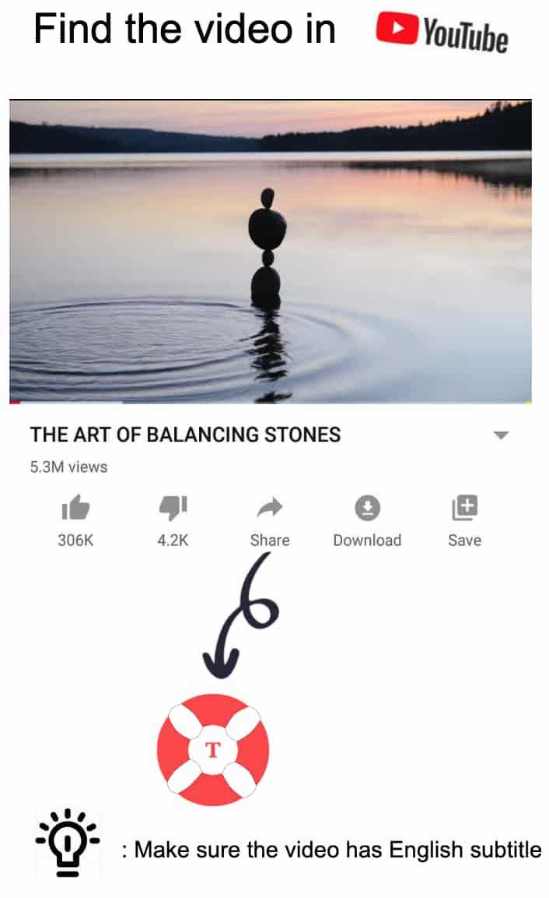

# English Buoy

EBuoy - Learn English through YouTube subtitles

Sync YouTube subtitles to the article then learn English word by word

You can play YouTube videos in APP and seek video time to the sentence.

- Share favorite YouTube video to this APP for add
- Short tap will copy the word to the clipboard, you can install any favorite dictionary APP to look up word meaning quickly.
- Long tap will tag this word is learned or not.

  
